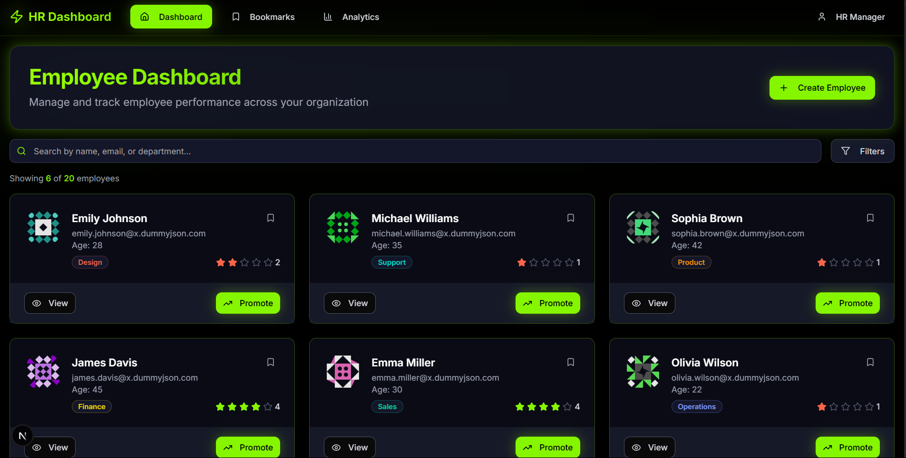
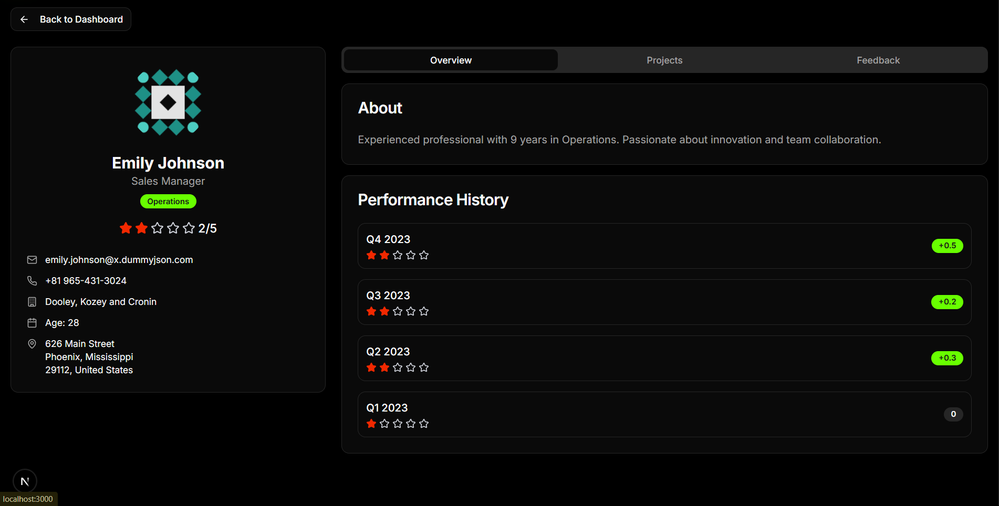
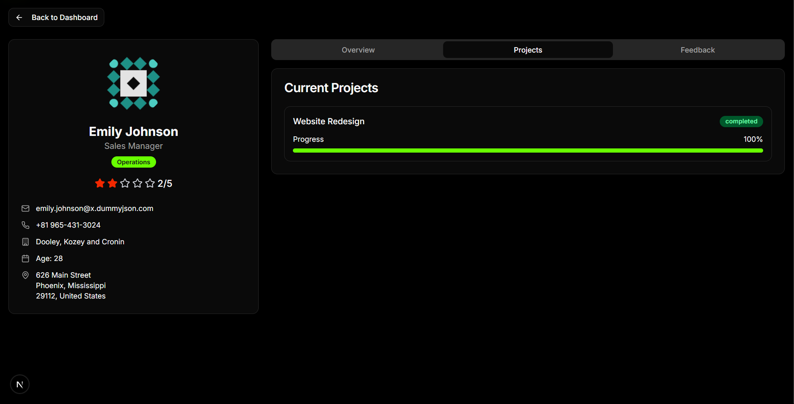
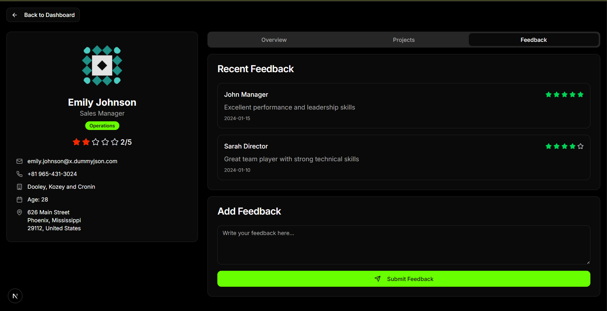
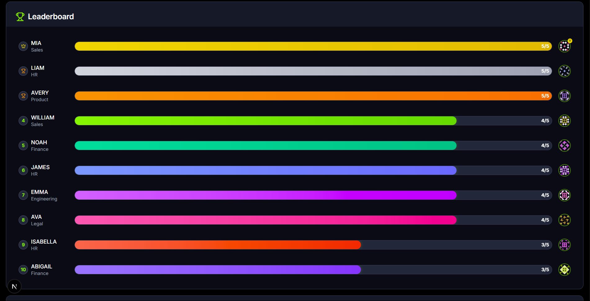
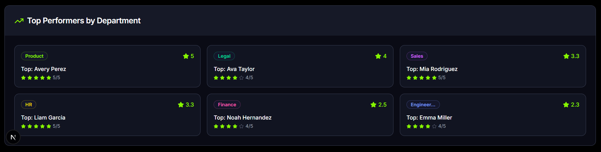
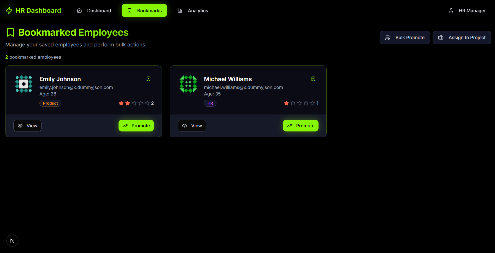
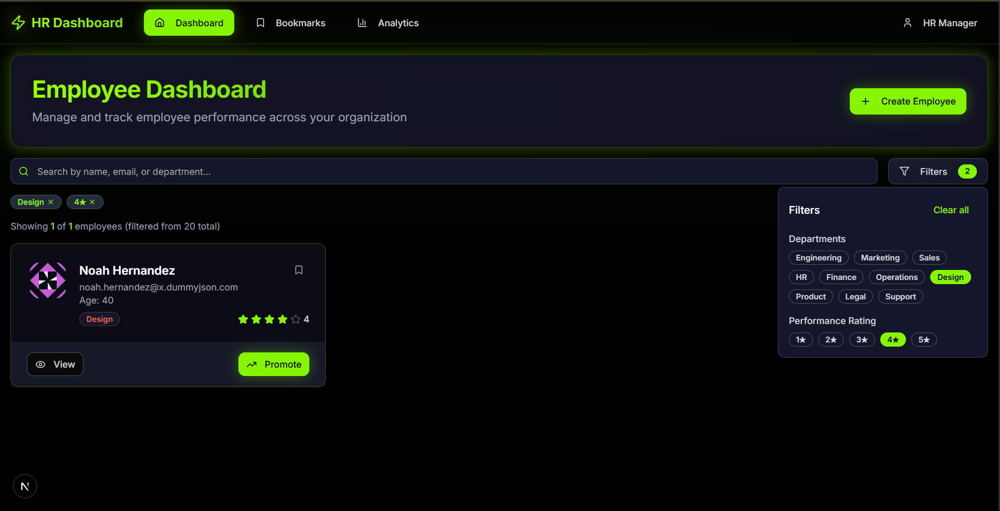

# HR Performance Dashboard

A modern, responsive HR dashboard built with Next.js, React, and Tailwind CSS. Features employee management, performance analytics, and a sleek cyber-themed design with black and lime green aesthetics.

## 🚀 Features

### 📊 **Analytics Dashboard**
- **Key Metrics**: Total employees, average ratings, high performers, bookmarked employees
- **Department Performance**: Visual progress bars showing average ratings by department
- **Rating Distribution**: Interactive charts showing employee rating breakdowns
- **Top Performers**: Showcase of highest-rated employees by department

### 👥 **Employee Management**
- **Employee Cards**: Interactive cards with photos, ratings, and department badges
- **Search & Filter**: Advanced filtering by name, email, department, and performance rating
- **Employee Profiles**: Detailed view with contact info, projects, and feedback history
- **Bookmark System**: Save and manage favorite employees

### 🎨 **Modern UI/UX**
- **Cyber Theme**: Black background with lime green accents and glowing effects
- **Responsive Design**: Works seamlessly on desktop, tablet, and mobile
- **Dark/Light Mode**: Toggle between themes with smooth transitions
- **Interactive Elements**: Hover effects, animations, and micro-interactions

### 🔧 **Technical Features**
- **Real-time Data**: Fetches employee data from external API
- **Local Storage**: Persistent bookmarks across sessions
- **Performance Optimized**: Memoized components and efficient rendering
- **Type Safety**: Full TypeScript implementation

## 📸 Screenshots


### 🏠 **Login Page**

*Static login for HR*


### 🏠 **Dashboard Homepage**

*Main dashboard showing employee cards with search and filter functionality*

### 👤 **Employee Profile**

*Detailed employee profile with tabs for overview, projects, and feedback*

*Detailed employee profile with tabs for projects*


*Detailed employee profile with tabs for feedback*


### 📊 **Analytics Dashboard**

*Comprehensive analytics with key metrics and performance charts*



*performance charts*

### 🔖 **Bookmarks Page**

*Saved employees with bulk action capabilities*

### 🔍 **Search & Filter**

*Advanced search and filtering interface with active filters*


## 🛠️ Tech Stack

- **Framework**: Next.js 14 (App Router)
- **Language**: TypeScript
- **Styling**: Tailwind CSS
- **UI Components**: shadcn/ui
- **Icons**: Lucide React
- **Charts**: Recharts (via shadcn/ui chart components)
- **Data Fetching**: Native fetch API
- **State Management**: React Context API

## 📦 Installation

1. **Clone the repository**
   ```bash
   git clone <repository-url>
   cd hr-performance-dashboard
   ```

2. **Install dependencies**
   ```bash
   npm install
   # or
   npm install --legacy-peer-deps
   # or
   yarn install
   # or
   pnpm install
   ```

3. **Run the development server**
   ```bash
   npm run dev
   # or
   yarn dev
   # or
   pnpm dev
   ```

4. **Open your browser**
   Navigate to [http://localhost:3000](http://localhost:3000)

## 🏗️ Project Structure

```
hr-performance-dashboard/
├── app/                          # Next.js App Router
│   ├── analytics/               # Analytics page
│   ├── bookmarks/               # Bookmarks page
│   ├── employee/[id]/           # Dynamic employee profile pages
│   ├── globals.css              # Global styles and CSS variables
│   ├── layout.tsx               # Root layout component
│   ├── loading.tsx              # Loading component
│   └── page.tsx                 # Homepage
├── components/                   # Reusable React components
│   ├── ui/                      # shadcn/ui components
│   ├── employee-card.tsx        # Employee card component
│   ├── employee-profile.tsx     # Employee profile component
│   ├── mode-toggle.tsx          # Dark/light mode toggle
│   ├── navbar.tsx               # Navigation component
│   ├── search-filter.tsx        # Search and filter component
│   └── theme-provider.tsx       # Theme context provider
├── lib/                         # Utility functions and types
│   ├── api.ts                   # API functions for data fetching
│   ├── bookmark-context.tsx     # Bookmark state management
│   ├── types.ts                 # TypeScript type definitions
│   └── utils.ts                 # Utility functions
├── hooks/                       # Custom React hooks
│   ├── use-mobile.tsx           # Mobile detection hook
│   └── use-toast.ts             # Toast notification hook
└── public/                      # Static assets
```

## 🎯 Key Components

### **Employee Card**
Interactive cards displaying:
- Employee photo with hover effects
- Name, email, age, and department
- Star ratings with color coding
- Bookmark functionality
- Promote button with animations

### **Analytics Dashboard**
Comprehensive analytics including:
- Key performance metrics
- Department performance charts
- Rating distribution visualizations
- Top performer showcases

### **Search & Filter**
Advanced filtering system:
- Real-time search across multiple fields
- Department-based filtering
- Performance rating filters
- Active filter indicators

## 🎨 Design System

### **Color Palette**
- **Primary**: Lime Green (`#B9FA00`)
- **Background**: Black (`#000000`)
- **Secondary**: Gray variations
- **Accents**: Department-specific colors

### **Typography**
- **Font**: Inter (Google Fonts)
- **Headings**: Bold, gradient text effects
- **Body**: Clean, readable text with proper contrast

### **Effects**
- **Cyber Glow**: Box shadows with lime green
- **Gradients**: Subtle background gradients
- **Animations**: Smooth transitions and hover effects

## 📊 Data Structure

### **Employee Interface**
```typescript
interface Employee {
  id: number
  firstName: string
  lastName: string
  email: string
  age: number
  phone: string
  address: Address
  company: Company
  image: string
  rating: number
  bio?: string
  projects?: Project[]
  feedback?: Feedback[]
}
```

### **Project Interface**
```typescript
interface Project {
  id: number
  name: string
  status: "completed" | "in-progress" | "pending"
  completion: number
}
```

## 🔧 Configuration

### **Tailwind CSS**
Custom configuration with:
- Cyber-themed color variables
- Custom gradient classes
- Responsive breakpoints
- Dark mode support

### **Next.js**
Optimized configuration:
- App Router for modern routing
- TypeScript support
- Image optimization
- Performance optimizations

## 🚀 Deployment

### **Vercel (Recommended)**
1. Push your code to GitHub
2. Connect your repository to Vercel
3. Deploy automatically with zero configuration

### **Other Platforms**
```bash
npm run build
npm start
```

## 🔮 Future Enhancements

### **Planned Features**
- [ ] Real-time notifications
- [ ] Advanced chart interactions
- [ ] Employee onboarding workflow
- [ ] Performance goal tracking
- [ ] Team collaboration tools
- [ ] Export functionality
- [ ] Mobile app version

### **Technical Improvements**
- [ ] Database integration
- [ ] Authentication system
- [ ] API rate limiting
- [ ] Caching strategies
- [ ] Performance monitoring
- [ ] Automated testing

## 🙏 Acknowledgments

- **shadcn/ui** for the beautiful component library
- **Lucide React** for the icon system
- **DummyJSON** for the mock employee data
- **Vercel** for hosting and deployment
- **Next.js** team for the amazing framework


**Built with ❤️ using Next.js and TypeScript**
